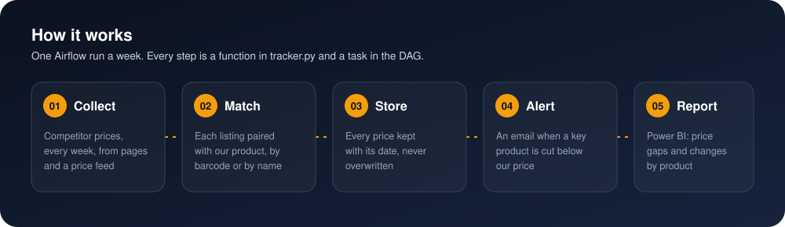
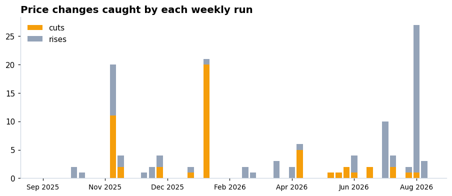
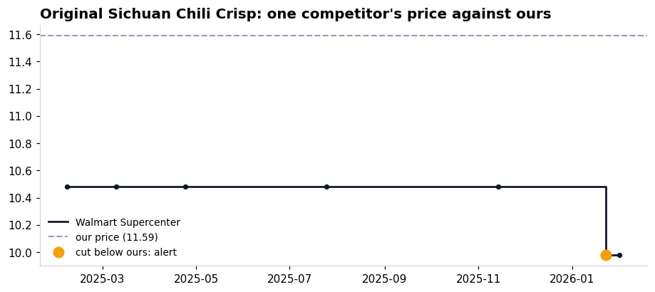
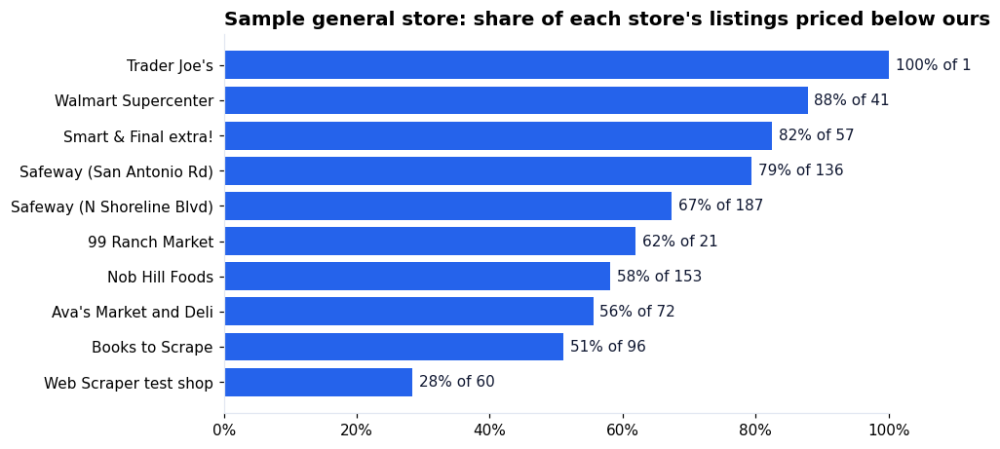

<p align="center">
  
</p>

<p align="center">
  
  
  
  
  
</p>

<h3 align="center">Know the week a competitor changes a price, and get an email<br>when one cuts a key product below yours.</h3>

<p align="center"><b>New client?</b> See <a href="docs/new-client.md">docs/new-client.md</a>.</p>

## The problem

Someone checks a few competitor sites by hand, now and then. By the time anyone notices that a
competitor cut the price of a best seller, the sales are gone. And nobody can say whether it was
a one-week promotion or the new normal, because no one wrote the old prices down.

## 🛠️ The solution

A pipeline that runs once a week on its own and keeps every competitor price it ever sees.

<p align="center">
  
</p>

1. **Collect.** It reads the competitors' product pages one listing page after another, as fast
   as each site answers (when a site says "too many requests", it waits as long as the site asks
   and carries on), plus the shelf prices published for the grocery stores that week.
2. **Match.** Each competitor listing is paired with our product: by barcode where there is
   one, by name where there is not. Names are compared on the words that identify a product
   (subtitles, series and filler words dropped), one listing per product per store, the closest
   pairs first.
3. **Store.** Every price goes into the history with its date. Nothing is updated or
   deleted, so any change can be found again later.
4. **Alert.** The run emails the key products a competitor cut below our price that week.
5. **Report.** Two Power BI pages: where we stand against each store, product by product, and
   what changed, week by week.

### 🔁 The mental model: one loop a week

<p align="center">
  
</p>

The history only grows. A price change is not stored anywhere: it is found by comparing each
price with the one before it (a window function in [sql/schema.sql](sql/schema.sql)). That is why
a late upload still lands in the right place: shoppers sometimes publish a receipt weeks after
the shopping trip, and the history orders prices by the day they were on the shelf, not by the
day they arrived.

## 📈 The result

**356 products across 10 stores: 127 price changes caught, each by the first weekly run that
could see it.** The checks behind every number are in [the notebook](analysis/analysis.ipynb).

- **127 price changes** on our products over 56 weekly runs (7 September 2025 to 4 October
  2026): 52 cuts and 75 rises; 61% of them moved to a price marked as a promotion.
- **Each change caught within one run:** all 127 were caught by the first run that had both
  prices. On the weekly schedule, the alert comes a median 2.8 days after the price is
  published, and never more than 7 days later.
- **17 undercuts** on key products (a cut below our price), in 6 of the 56 weekly runs.
- **Matching:** all 200 grocery products found by barcode; 156 of the 160 web shop products
  found by name, with **0 wrong matches**.
- **Where we stand now:** 64% of competitor listings are priced below ours; the chart below
  splits it by store.

<p align="center">
  
</p>

<p align="center">
  
  
</p>

## 📊 Power BI

The report reads the warehouse directly. The [powerbi/](powerbi/) folder rebuilds it from an
empty file by copy and paste: the queries, the model, every measure, every visual with its
fields, the theme, and the numbers each card must show.
<!-- Screenshots of the two pages go here once the report is built: powerbi/screenshots/ -->

## ▶️ Run it

You need Docker Desktop.

```bash
git clone https://github.com/omarshalabyy1/competitor-price-tracker
cd competitor-price-tracker
cp .env.example .env          # set DB_PASSWORD; the Gmail lines are optional
docker compose up -d --build  # Airflow http://127.0.0.1:8090, warehouse localhost:5440
```

Open Airflow, unpause `competitor_prices`, and it catches up one week at a time from
September 2025 (about half an hour), then runs every Sunday. Only the latest week reads the web
shops and sends the email: their pages show today's prices only. To re-run a step for one week,
open that run in Airflow and press **Clear** on the task (on Airflow 3.3 the `airflow tasks
clear` command did nothing here; the UI and the REST API work).

Then the numbers and the tests:

```bash
pip install -r analysis/requirements.txt
jupyter lab analysis/analysis.ipynb
pip install -r requirements.txt pytest && pytest
```

| Where | What |
|---|---|
| [config/client.yaml](config/client.yaml) | Every client value: competitors, rules, schedule, colours (read through [config.py](config.py)) |
| [tracker.py](tracker.py) | The steps: collect, match, alert; one function each |
| [parsers.py](parsers.py) | One page reader per competitor web shop |
| [dags/competitor_prices.py](dags/competitor_prices.py) | The weekly Airflow DAG |
| [sql/schema.sql](sql/schema.sql) | Tables and the views for changes, gaps and undercuts |
| [data/input/](data/input/) | Our catalogue, and the guide to the input files |
| [make_catalogue.py](make_catalogue.py) | How the demo catalogue was made (run once) |
| [theme.py](theme.py) | Writes the Power BI theme from the config's colours |
| [docs/new-client.md](docs/new-client.md) | Using this repo as a template for a client |
| [analysis/](analysis/) | The notebook behind every number |
| [powerbi/](powerbi/) | The report, step by step |
| [tests/](tests/) | Page parsing and name matching |

## 🗂️ Data

- **Grocery prices:** [Open Prices](https://prices.openfoodfacts.org) by Open Food Facts, shelf
  prices that shoppers publish, for nine stores in Mountain View, California. Read through its
  public API, as fast as it answers. The data is under the
  [Open Database License](https://opendatacommons.org/licenses/odbl/1.0/), © Open Prices
  contributors.
- **Web shop pages:** [Books to Scrape](https://books.toscrape.com) and the
  [Web Scraper test shop](https://webscraper.io/test-sites/e-commerce/static), two sites built
  for scraping practice; their prices do not change.
- **Our catalogue** ([data/input/catalogue.csv](data/input/catalogue.csv)) is made up by
  [make_catalogue.py](make_catalogue.py): the 200 grocery products the most of those stores sell,
  priced near their usual price, and 160 web shop products renamed the way our catalogue names
  them, with the right answers in [data/input/match_truth.csv](data/input/match_truth.csv). It uses product
  names and barcodes from Open Food Facts and is shared under the same ODbL licence. The store
  is made up; the competitor prices are real.
